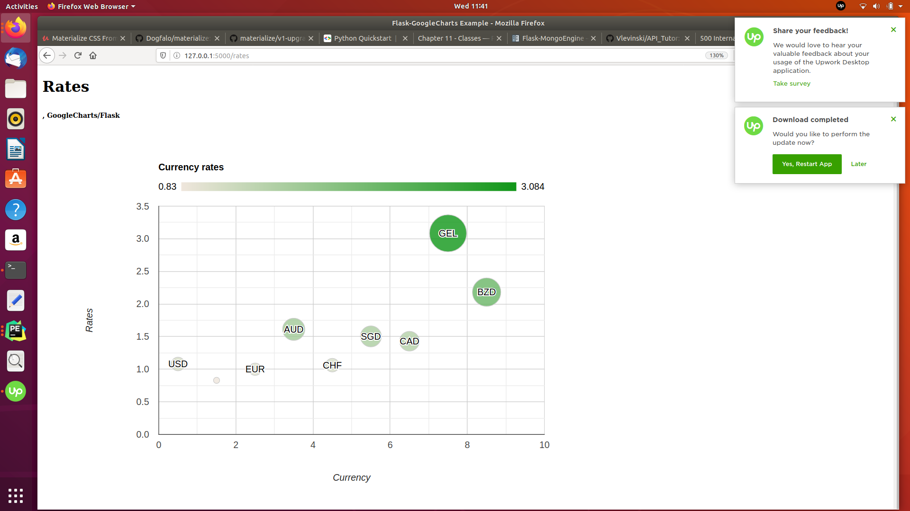

# API Tutor

## Learn how to create API apps with Flask by example

 App's: app_hello.py get_rates_pub.py  
        main.py  
        /templates

1. Get an api_key to be able to get your rates from
   http://data.fixer.io/api/
2. Get_data with rates_pub.py when have api_key after inserting your key in
   the app
3. Update the key in the main.app
4.  Start main.py locally
5.  use endpoint rates to ger rates in the Browser

